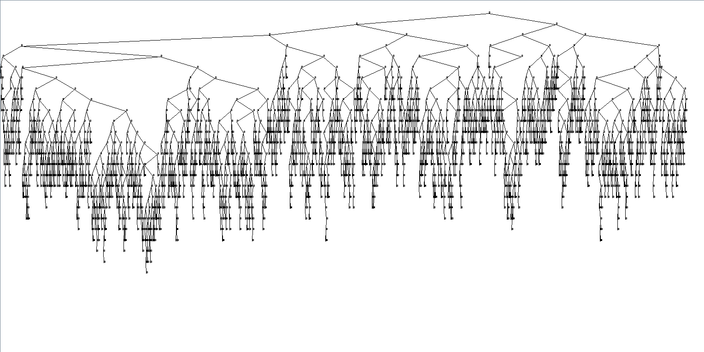
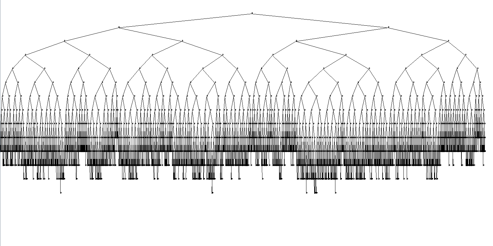

# AVL-BST-Visualizer
A java implimentation of an AVL tree and Binary Search Tree with visual output and search functionality. 

#3 Binary Search Tree output

#3 AVL Tree output

#3 You can find more information on my website [here](https://liam-watson.com)

